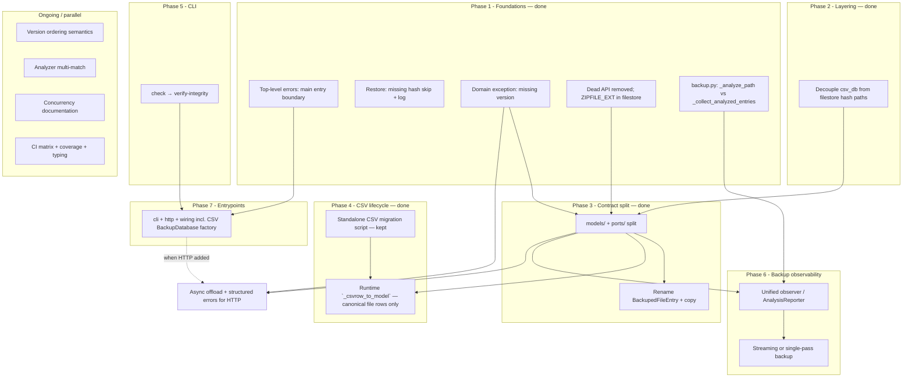

# Tech debt roadmap

Canonical in-repo backlog for planned refactors and technical debt. **Assumption:** all items will be addressed; order below optimizes for **dependencies, reduced rework, and quality**—not for cutting scope.

Short index of files in this folder: [docs/README.md](README.md).

---

## Guiding principles

1. **Shrink surface area before large moves** — Remove or wire dead code before splitting `interfaces/` so migrations carry less baggage.
2. **Stabilize contracts early** — Domain exceptions and clear layering make later refactors (`models/` + `ports/`, HTTP) safer.
3. **CSV manifests** — Operators upgrade legacy version CSVs with the **standalone migration script**; the **`backuper` runtime** reads **canonical rows only** (see [`docs/csv-migration-contract.md`](csv-migration-contract.md)).
4. **CLI rename and backup pipeline** — Can proceed in parallel once foundations exist; unify observer + streaming when touching the same code paths.
5. **CSV adapter boundary** — Prefer a **composition-root factory** that returns `BackupDatabase` and keeps `CsvDb` implementation-private; **merge** the two classes only if the split stops earning its keep (larger change).
6. **Honest async** — `asyncio.run()` and `async def` / `AsyncIterator` ports do **not** by themselves improve throughput or responsiveness for this **single-process CLI** when the heavy work remains **blocking disk, CSV I/O, and sync hashing** on the main thread. Gains come from **offloading** (`asyncio.to_thread`, bounded pools), **true overlap** (pipelining, parallelism with caps), or **redundant I/O fixes**—not from more `async` wrappers alone.

---

## Workstreams (themes)

| ID | Theme | Summary |
|----|--------|---------|
| A | **Safety & UX** | Top-level errors, restore behavior, copy/grammar |
| B | **Domain & errors** | Typed failures instead of `RuntimeError` / loose `ValueError` mapping |
| C | **Dead / duplicate surface** | Remove or implement unused types; merge test-only paths |
| D | **Layering** | `csv_db` ↔ `filestore` decoupling; shared helpers or ports |
| E | **Contract architecture** | Split `interfaces/` → `models/` + `ports/`; import-linter + `AGENTS.md` |
| F | **CSV lifecycle** | **Standalone migration script** (required for legacy trees) + **runtime** `_csvrow_to_model` accepts canonical rows only |
| **F′** | **CSV adapter composition** | `CsvDb` + `CsvBackupDatabase` double construction at call sites; factory (preferred) or single-class merge |
| G | **CLI product** | `check` → `verify-integrity` (single integrity command) |
| H | **Backup pipeline** | Streaming vs full list; unified `AnalysisReporter` / observer |
| I | **Semantics & docs** | Version ordering; analyzer multi-match; concurrency / single-writer |
| J | **Entrypoints & multi-UX** | `entrypoints/cli/`, reserved `http/`, optional `wiring.py`; async/blocking policy when HTTP exists |
| K | **CI & typing** | Python matrix; optional mypy/pyright; coverage thresholds in CI |
| **L** | **Throughput & blocking I/O** | Single-pass CSV reads; optional bounded parallel hashing / pipelining (profiled); distinguish CLI vs HTTP async policy |

---

## Dependency map

Edges mean **“should complete or start before / strongly informs”**. Items with no incoming edges can start early.

**Narrative dependencies (not all drawn as edges):**

- **Diagram gaps:** Workstream **L** (throughput, redundant CSV reads) has **no node** in the chart; see **6.4**–**6.5** and **Implementation hooks (L)**. Phase **1.6** (logging / `--quiet` / `check --json`) shipped with Phase 1 and is not drawn separately.
- **F2** (runtime canonical-only) is paired with **F1** (migration for existing trees): operators run **`scripts.migrate_version_csv`** before using current **`backuper`** on legacy manifests. **E1 → F2** is an ordering preference (cleaner types before shrinking `_csvrow_to_model`).
- **H2** (streaming) overlaps **H1** (observer); doing both in one effort avoids double refactors of `_run_backup_stream`.
- **L** (single-pass **`list_files`**, redundant I/O) is a **quick sync win** and can land before or alongside **H2**; it does not depend on an async strategy.
- **Multi-UX** items (async in `run_restore_flow`, injectable config vs globals, HTTP error mapping) **activate when HTTP is real**; contract **E** and domain errors **B** reduce pain first. **CLI** blocking behavior is a separate concern from **Phase 10** (*When HTTP / second composition root exists*—event-loop fairness under HTTP).
- **I*** (version order, analyzer, concurrency) are mostly parallel documentation or small hardening—schedule anytime after Phase 1.
- **`CsvDb` + `CsvBackupDatabase` (F′)** — Implement **Phase 7.1** via **`wiring.py`** (or equivalent): one construction path for production code, tests using helpers or the same factory. **Merge** into one class remains a fallback if the port/adapter split is pure ceremony; if merged, revisit after **D**/**E** so imports and tests move once.

---

## Prioritization order (execution phases)

Phases are **sequential recommendations**; within a phase, items can often run in parallel (e.g. CI workstream **K** alongside coding phases).

### Phase 1 — Foundations (safety, correctness, noise reduction)

**Status:** Complete. Top-level handling lives on **`main()`** in [`src/backuper/entrypoints/main.py`](../src/backuper/entrypoints/main.py) (`run_with_args` keeps parse+dispatch only—no outer try/except, for tests and direct callers); restore skips missing hashes with warnings; **`VersionNotFoundError`**; grammar fixes; streaming types removed and **`ZIPFILE_EXT`** canonical in filestore; **`backuper`** logger, **`-q` / `--quiet`**, and **`check --json`**.

| Order | Item | Notes |
|------:|------|--------|
| 1.1 | Centralize top-level error handling in the CLI entry (`main()`) | Avoid raw tracebacks for users; `ValueError` → stderr, unexpected → log + generic message |
| 1.2 | Restore: **skip + log** for missing hash; align `run_restore_flow` | Implemented |
| 1.3 | Replace `RuntimeError` in `CsvDb.get_version_by_name` with **`VersionNotFoundError`**; narrow controller mapping | Sets pattern for Phase 3 and HTTP |
| 1.4 | Fix “does not exists” and similar copy; adjust tests | Mechanical |
| 1.5 | Remove **dead surface**: `BackupChunk` / `BackupStreamProcessor` / `BackupWriter`; **`ZIPFILE_EXT`** vs inlined `.zip` in filestore | Reduces migration load for **E** |
| 1.6 | **`print`**-only CLI reduced: **structured logging**, **`--quiet`**, **`check --json`** | Broader migration of backup progress to logging remains Phase 6 |

### Phase 2 — Layering

**Status:** Complete. **`csv_db`** does not import **`filestore`**; path and hash helpers live in **`src/backuper/utils/`** (`paths.py`, `hashing.py`); **`components/utils.py`** removed; **`AGENTS.md`** layering and import-linter rules for **`utils`** vs **`components`** updated.

| Order | Item | Notes |
|------:|------|--------|
| 2.1 | Extract `hash_to_stored_location` (or equivalent) so **`csv_db` does not import `filestore`** | Prefer helpers under a neutral module or narrow port (**D**) |

### Phase 3 — Contract architecture

**Status:** Complete. **`interfaces/`** removed in favor of **`models/`** (value types + domain exceptions) and **`ports/`** (ABCs only; **`ports` → `models`**); import-linter contracts and **`AGENTS.md`** layering updated; **`BackupedFileEntry`** renamed to **`BackedUpFileEntry`** with copy fixes; application **`ValueError`** in **`src/backuper/`** replaced with typed **`UserFacingError`** subclasses for CLI and controller boundaries.

| Order | Item | Notes |
|------:|------|--------|
| 3.1 | Split **`interfaces/`** into **`models/`** + **`ports/`**; `ports` → `models` only; thin re-exports | Prefer the name **`models/`** over e.g. **`dtos/`** for this codebase; update import-linter + `AGENTS.md` |
| 3.2 | Rename **`BackupedFileEntry`** and clean “backuped” help strings | Breaking; bundle with **3.1** if possible |
| 3.3 | Revisit **`ValueError`** vs domain types for mappable outcomes (prepares HTTP) | Extends **1.3** |

### Phase 4 — CSV legacy lifecycle

**Status:** Complete. **`scripts/migrate_version_csv`** remains the **supported path** to convert legacy manifests; **`_csvrow_to_model`** in **`csv_db.py`** accepts **canonical `f` rows only** (at least seven columns). Unmigrated backup trees are not readable by the current runtime—operators must run migration first (see **[`docs/csv-migration-contract.md`](csv-migration-contract.md)**).

| Order | Item | Notes |
|------:|------|--------|
| 4.1 | **Standalone** migration under `scripts/` (outside core hot path) | `uv run python -m scripts.migrate_version_csv`; tests under `test/scripts/` |
| 4.2 | **Simplify `_csvrow_to_model`** to canonical shape only in the runtime | Legacy decode lives in the migration script, not in `CsvDb` |

### Phase 5 — CLI integrity command

**Status:** Complete. The CLI integrity command was hard-renamed from **`check`** to **`verify-integrity`** with no compatibility alias, and parser/dispatch/tests/docs were updated while preserving behavior (including `--json` output mode).

| Order | Item | Notes |
|------:|------|--------|
| 5.1 | **`check` → `verify-integrity`**; optional depth/cost flags on one command | `argparser`, `cli`, `commands`, controllers, tests, `README.md`, `AGENTS.md` |

### Phase 6 — Backup pipeline and observability

| Order | Item | Notes |
|------:|------|--------|
| 6.1 | Merge or delete **`_analyze_path`** vs **`_collect_analyzed_entries`** drift | From dead/duplicate notes |
| 6.2 | Unify on **observer / `AnalysisReporter`** for analysis, progress, phases | Replace ad hoc callbacks from `cli.py` |
| 6.3 | **Single pass** / streaming from `analyze_stream` where semantics allow | Addresses memory + double iteration; pairs with **6.2**. **6.3a** (design): streaming invariants under *Implementation hooks* → *Reporting / backup pipeline*. |
| 6.4 | **`list_files` redundant CSV I/O**: `CsvBackupDatabase.list_files` calls **`get_files_for_version`** then **`get_dirs_for_version`** — each **opens and fully parses** the same version CSV (`CsvDb` in `csv_db.py`). Replace with **one read** per version (e.g. `get_fs_objects_for_version` + split, or single pass filtering `f`/`d`) | Clear win for restore/check on large manifests; **sync** optimization |
| 6.5 | **Hashing / disk throughput** (if profiling shows hot paths): **bounded** parallel hashing and/or overlapping blob writes — thread/process pool with a **cap**; measure before widening | Not “more asyncio” alone; avoid unbounded disk parallelism (thrashing) |

### Phase 7 — Entrypoints structure (before HTTP)

| Order | Item | Notes |
|------:|------|--------|
| 7.1 | **`CsvDb` + `CsvBackupDatabase`**: **`CsvBackupDatabase`** is the **`BackupDatabase`** port over **`CsvDb`** (paths, versions, row models); split can stay valid (**storage vs port**). Composition-root **factory** returning **`BackupDatabase`**; treat **`CsvDb`** as private; tests use factory or helpers | Merge into one class only if the boundary no longer helps |
| 7.2 | **`entrypoints/cli/`** (main, argparser, stdout adapter); reserve **`entrypoints/http/`** (e.g. lightweight ASGI such as **Starlette**, TBD); optional **`wiring.py`** hosting shared construction | Keeps `python -m backuper` on CLI; **7.1** fits naturally here |
| 7.3 | Enforce convention: HTTP uses **controllers + wiring**, not `run_new` / `run_check` | Review + docs; import-linter optional |

### Phase 8 — Semantics and documentation

| Order | Item | Notes |
|------:|------|--------|
| 8.1 | **`get_most_recent_version`**: document lexicographic semantics or switch to mtime / explicit order | Behavior or docs |
| 8.2 | **Analyzer**: document or harden “first match wins” when multiple stored files match | |
| 8.3 | **Concurrency**: document single-writer expectation or add locking | Filestore staging handles some races; CSV append / multi-writer unclear |

### Phase 9 — CI and static quality

| Order | Item | Notes |
|------:|------|--------|
| 9.1 | **Python version matrix** in CI | Beyond 3.11-only |
| 9.2 | **Coverage thresholds** in CI (align with `make test-coverage`) | |
| 9.3 | **mypy or pyright** in `make lint` | When team commits to typing discipline |

### Phase 10 — When HTTP / second composition root exists

| Order | Item | Notes |
|------:|------|--------|
| 10.1 | Policy: **blocking ports** + thread pool vs **async ports** | Document first |
| 10.2 | Offload sync disk work from **async** controllers (e.g. `run_restore_flow`) | `asyncio.to_thread` / executor |
| 10.3 | **Injectable config** instead of module globals at composition | e.g. `ZIP_ENABLED` |
| 10.4 | **Structured / stable error codes** for HTTP; map domain exceptions to status + JSON | Builds on **1.3** and **3.3** |

---

## Quick reference: theme → phase

| Topic | Primary phase(s) |
|-------|-------------------|
| CLI `check` → `verify-integrity` | 5 |
| Restore missing hash | 1 |
| Domain `RuntimeError` / version | 1, 3 |
| `csv_db` imports `filestore` | 2 |
| `models/` + `ports/` (naming: see **Implementation hooks**) | 3 |
| Dead or duplicate API | 1, 6 |
| Version ordering | 8 |
| Backup memory / full list | 6 |
| Analyzer multiple matches | 8 |
| UX / grammar / copy | 1 (e.g. 1.4) |
| Structured logging / `--quiet` / machine-readable output | 1 (1.6) |
| Uncaught exceptions | 1 |
| CSV migration + canonical runtime rows | 4 |
| `CsvDb` + `CsvBackupDatabase` (factory vs merge) | 7 |
| CI and tooling | 9 |
| Naming `BackupedFileEntry` | 3 |
| Concurrency assumptions | 8 |
| Entrypoints restructure | 7 |
| Multi-UX (HTTP) | 3, 10 |
| Reporting / `AnalysisReporter` | 6 |
| Async vs blocking I/O, hashing, redundant CSV reads | 6, 10, **Implementation hooks** |
| Throughput / parallelism (bounded) | 6 |

### Epic item IDs (dependency map)

| ID | Node label |
|----|------------|
| A1 | Top-level errors: `main()` entry boundary |
| A2 | Restore: missing hash skip + log |
| B1 | Domain exception: missing version |
| C1 | Dead streaming API removed; `ZIPFILE_EXT` in filestore |
| C2 | `backup.py`: `_analyze_path` vs `_collect_analyzed_entries` |
| D1 | Decouple `csv_db` from filestore hash paths |
| E1 | `models/` + `ports/` split |
| E2 | Rename BackupedFileEntry + copy |
| F1 | Standalone CSV migration script |
| F2 | Runtime `_csvrow_to_model`: canonical file rows only |
| G1 | `check` → `verify-integrity` |
| H1 | Unified observer / AnalysisReporter |
| H2 | Streaming or single-pass backup |
| J1 | `cli` + `http` + wiring incl. CSV BackupDatabase factory |
| J2 | Async offload + structured errors for HTTP |
| I1 | Version ordering semantics |
| I2 | Analyzer multi-match |
| I3 | Concurrency documentation |
| K1 | CI matrix + coverage + typing |

---

## Implementation hooks

Detail preserved from earlier working notes—**not** extra scope by default; use when implementing the matching phase.

### Contract split (**E** / Phase 3)

- Dependency direction: **`ports` → `models` only**; packages re-export via each package’s **`__init__.py`** (no separate **`interfaces/`** shim).
- Naming: prefer **`models/`** over a single `interfaces` bucket or `dtos/` + `ports/` — **`models`** reads better here.

### CSV migration (**F** / Phase 4) — shipped

- **Operators** with existing backup trees **must** run the migration script before using the current runtime; details are in **[`docs/csv-migration-contract.md`](csv-migration-contract.md)**.
- Canonical rows for the **runtime**: `d` as 3 columns (`kind`, normalized path, reserved empty field), `f` as 7 columns (`kind`, restore path, hash, stored location, compressed flag, size, mtime).
- **Migration script** accepts legacy file rows (3 / 5 / 7+ columns), maps them to canonical rows, and documents fail-fast policy, idempotency, atomic writes, and maintenance-window guidance.

### Reporting / backup pipeline (**H** / Phase 6)

- Today **`_run_backup_stream`** wires **`AnalysisReporter`** for summary and file progress after **`_collect_analyzed_entries`** materializes the full list; the same list is iterated again for progress + **`db.add_file`** / **`filestore.put`** (double pass + peak memory vs the analyzed list).
- Optional later: **`async` reporting sinks** if HTTP needs non-blocking hooks; sync reporting is unlikely to beat disk I/O as the bottleneck.

**6.3a — Streaming backup invariants (design hook for H2 / 6.3).** A single-pass or streaming pipeline must preserve today’s observable semantics unless a follow-up explicitly changes them:

1. **Directory vs file order** — Match **`LocalFileReader.read_directory`**: for each `os.walk` root, emit **all child directory `FileEntry`s** (`is_directory=True`) **before** **files** in that directory; continue in **`os.walk` DFS order**. Each yielded analyzed entry corresponds to **one** **`db.add_file`** for the version **including directories** (same manifest shape as the materialized path).

2. **Dedup / hash lookups** — For **files**, **`BackupAnalyzerImpl.analyze_stream`** tries **metadata** (`get_files_by_metadata`) then, on miss, **sync `compute_hash`** and **content** (`get_files_by_hash`); **`stored_files[0]`** (first match) wins at each step. **`_to_backed_up_entry`** uses **`get_files_by_hash`** again when **`already_backed_up`** and **`entry.hash`** are set, again taking the **first** match. Streaming must **complete per entry** in walk order so “first match” and CSV rows stay aligned (ties with Phase **8.2**).

3. **Summary and progress granularity (6.3b — locked)** — Controllers **incrementally accumulate** analysis aggregates via **`BackupAnalysisSummaryAccumulator`** (`models`), then emit **one** **`report_analysis_summary`** after the **analysis leg** ends and **before** the **backup leg** (current CLI: summary first, then “Processed …%”). **`report_file_progress(i, total)`** keeps **`total == summary.num_files`** with **no** unknown-total API and **no** extra filesystem pass for counts; **`i`** is **0-based** in **walk order**; throttle stays ~**1%** of files. A future **streaming backup** pipeline (**6.3c**) must preserve this **phase ordering** unless UX changes are intentional and documented.

### Multi-UX / HTTP (**J** / Phase 10)

- **Already aligned:** controllers use injected ports; **`entrypoints/cli.py`** is one composition root; HTTP would be **another** root wiring the same components—**intentional duplication of wiring**, not a layer violation.
- **Lower / indirect:** **`commands.py`** DTOs stay use-case-shaped; HTTP maps JSON → same types unless some fields become CLI-only (then split transport vs use-case input). **`main.py`** stays CLI dispatch only—not structural debt if HTTP stays separate. **`csv_db` ↔ `filestore`** coupling is maintainability debt, not HTTP-only.

### Async facades, blocking I/O, and throughput (**L** / Phases 6 & 10)

Validated against the current tree (see code references below).

**Context.** The CLI uses **`asyncio.run()`** (`entrypoints/cli.py`). Controllers and ports use **`async`/`AsyncIterator`**, but most expensive work is still **blocking**: filesystem and CSV I/O, **synchronous hashing**, and a **fully synchronous `FileStore`** (`put`, `read_blob`, …). Adding `async` without changing what runs or how it overlaps does **not** improve throughput or responsiveness for this **single-process CLI**.

**1. Async facades over blocking I/O**

- **`CsvDb`** is **synchronous** (`open`, `csv.reader`, append writes, etc.). **`CsvBackupDatabase`** exposes **`async def`** port methods that **delegate synchronously** to `CsvDb`—no real non-blocking I/O.
- **`LocalFileReader.read_directory`** is an async generator built on blocking **`os.walk`**, **`os.path.getmtime`**, **`os.path.getsize`** (`file_reader.py`).
- **`FileStore` / `LocalFileStore`**: port is **fully sync**. **`_to_backed_up_entry`** in `backup.py` calls **`filestore.put(...)`** without awaiting non-blocking work.
- **`run_restore_flow`**: **`restore_path.write_bytes(filestore.read_blob(...))`** — sync disk read/write inside an `async def` (`restore.py`).

**Implication:** The event loop can be blocked for long stretches; **`asyncio` alone** does not yield better interleaving unless work is **offloaded** (`asyncio.to_thread`, bounded pools) or I/O is redesigned. For **HTTP**, Phase **10** covers event-loop fairness; for **CLI**, see **Guiding principle 6** (Honest async).

**2. Hashing and analysis block the loop**

- **`BackupAnalyzerImpl.analyze_stream`** calls synchronous **`compute_hash(file_entry.path)`** when metadata lookup fails (`backup_analyzer.py`, `utils.py`). Large or many files that need hashing block the loop during analysis.

**Implication:** Wall-clock gains may need **parallel hashing with a cap** (Phase **6.5**) or other overlap—not only `async def`.

**3. No streaming pipeline for backup (full materialization)**

- **`_collect_analyzed_entries`** builds a **full list**; **`_run_backup_stream`** then **`for entry in analyzed_list`** with sync **`filestore.put`** / **`db.add_file`** (`backup.py`). No producer/consumer overlap.

**Implication:** Higher peak memory on large trees; pipelining needs threading/async design—tracked as **H2** / **6.3** (streaming types were **removed** in Phase **1.5**).

**4. Redundant CSV reads in `list_files`**

- **`CsvBackupDatabase.list_files`** calls **`get_files_for_version`** and **`get_dirs_for_version`**. Each opens the **same** version CSV and parses all rows (filtering `f` vs `d`). **Two full passes** per version per call.

**Implication:** Straightforward **sync** optimization (Phase **6.4**); `get_fs_objects_for_version` already reads the file once.

**5. Streaming abstractions (historical)**

- **`BackupStreamProcessor`**, **`BackupWriter`**, **`BackupChunk`** were **removed** from `interfaces` (Phase **1.5**). A future streaming pipeline would introduce new types alongside **6.2** / **6.3**.

**6. Progress / “responsiveness”**

- Long blocking stretches (`put`, `compute_hash`) run without **`await`** points that yield real overlap; progress callbacks do not get finer interleaving from **`asyncio`** alone.

**Implication:** Better UX may need **chunking**, **thread-based work with progress from workers**, or **explicit yields**—not only more async wrappers.

**Suggested prioritization (maps to epic)**

| Priority | Item | Phase |
|----------|------|--------|
| Quick win | Single-pass CSV for **`list_files`** | **6.4** |
| Throughput (if profile says so) | Bounded parallelism for hashing and/or blob writes | **6.5** |
| Architecture | Streaming analysis → backup | **6.1–6.3** |
| Honest async | After concurrency/streaming strategy is clear; avoid wrapping blocking calls in `async def` without **`to_thread`** or real overlap | **Guiding principle 6**; **Phase 10** |

**Non-goals (unless requirements change)**

- Assuming **more `async` keywords** alone fixes performance or UI responsiveness for this workload.
- **Unbounded** parallelism on disk (thrashing risk); cap and measure.

**Code references**

- `entrypoints/cli.py` — `asyncio.run`
- `controllers/backup.py` — `_collect_analyzed_entries`, `_run_backup_stream`, `_to_backed_up_entry`
- `components/csv_db.py` — `CsvDb`, `CsvBackupDatabase.list_files`, `get_files_for_version`, `get_dirs_for_version`, `get_fs_objects_for_version`
- `components/filestore.py` — synchronous `LocalFileStore`
- `components/file_reader.py` — `LocalFileReader`
- `components/backup_analyzer.py`, `utils/hashing.py` — `compute_hash`
- `controllers/restore.py` — `run_restore_flow`
- `ports/__init__.py`, `models/__init__.py` — ports and value types (streaming placeholder types removed in Phase 1)

---

## Risks if order is ignored

- **Contract split (E) before dead-code cleanup (C)** — More symbols and import paths to move twice.
- **Using the runtime on an unmigrated backup tree** — Legacy manifests will not parse; run **`scripts.migrate_version_csv`** first (see [`docs/csv-migration-contract.md`](csv-migration-contract.md)).
- **HTTP (10) before domain errors and structured failures (1, 3)** — Adapters re-map stringly `ValueError` repeatedly.
- **Streaming (H2) without observer unification (H1)** — Two disruptive changes to the same hot path.
- **HTTP or a second entrypoint before CSV factory (7.1)** — Risk duplicating `CsvBackupDatabase(CsvDb(...))` wiring; do **7.1** before or with the first non-CLI composition root.
- **“More asyncio” without strategy** — Wrapping blocking I/O in `async def` without **`to_thread`**, overlap, or removing redundant reads (**6.4**) adds complexity without guaranteed gains; profile first (**6.5**).

---

*Edit this file when the backlog changes.*
